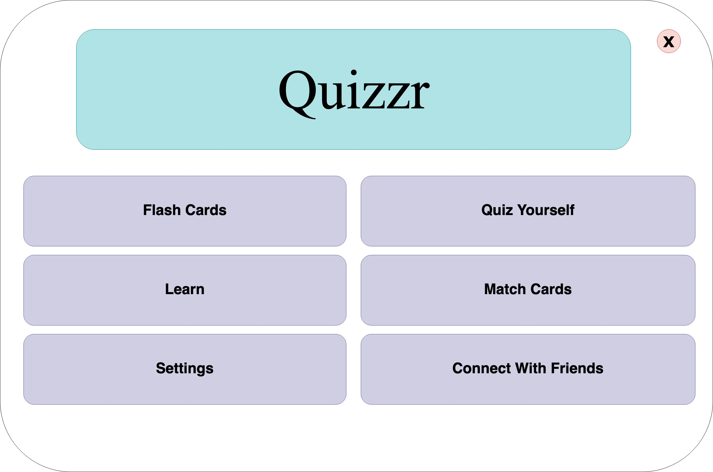
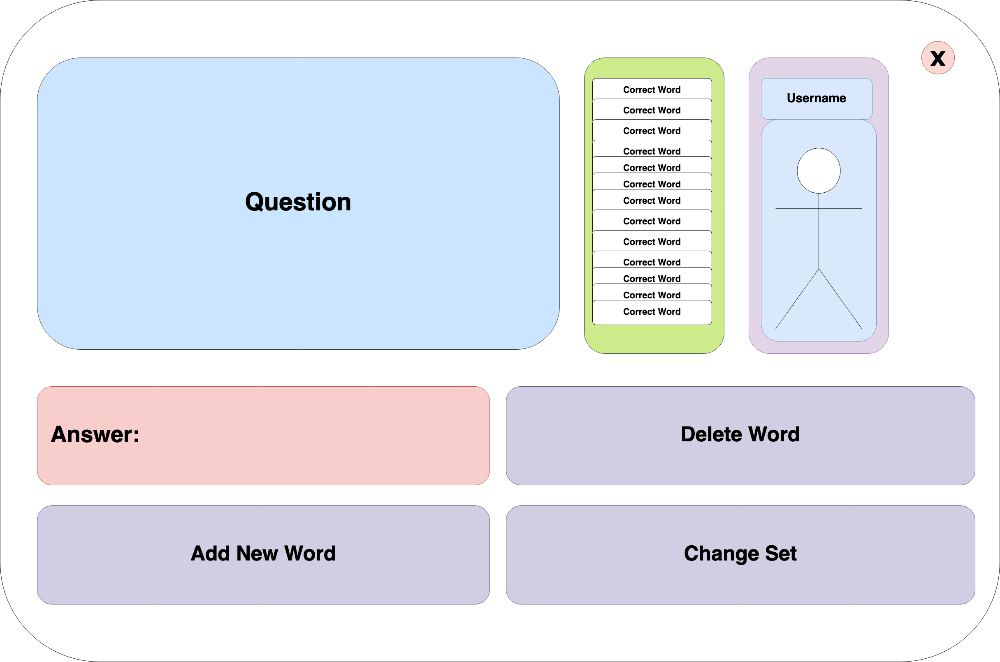

# German Quiz Game
German Quiz Master is an engaging and educational quiz game designed to test your knowledge of the German language. Whether you're a beginner or an advanced learner, this interactive game offers a fun way to enhance your German vocabulary, grammar, and comprehension skills.

Featuring a sleek and intuitive user interface built with the Dear PyGui library, German Quiz Master provides a seamless gaming experience for players of all levels. The minimalist design ensures easy navigation and focus on the quiz questions, allowing users to immerse themselves in the learning process without distractions.

# Purpose
The purpose of this application is to train german skills, this project randomly generates german words, asking for the translation from the user. This allows users to tests words they may not have seen before. I am currently a student and have had difficulty learning german because of this I created this program to help me study. 

****
# Installation
>[!Note]
>For Windows users, the process may differ. For best results use Linux or Mac.

To install this project, follow these steps:
1. Clone the repository to your local machine:
   - ```
     git clone https://github.com/awa03/German-Quiz-Game.git
     ```
2. Navigate to the project directory:
   - ```sh
     cd German-Quiz-Game
     ```
4. Install the required dependencies:
   - ```sh
     sudo apt-get install pip
     ```
5. Run the setup script:
   - ```sh
     cd Setup
     ./Install.sh
     ```
If you would like to run the precompiled version simply navigate to the dist directory using the command.
```sh
      cd dist # Navigates To Directory
     ./main   # Launches the Program
```
This will allow you to run the program without needing to run any commands! You can also do this by opening the directory from your file browser and launching the application.
For more detailed instructions, refer to the [Installation Guide](Docs/installation.md).
****
# Convert Sets From Quizlet
Please Refer to the [Documentation](Docs/quizlet_conversion.md) for detailed instructions.
****

# Loading Files Manually
Please navigate to the Windows directory, and then the Study Set directory. This can be done via commands as follows:
```sh
cd Windows/Study_Set
```
Then by modifying the active_set.json you can add words and definitions to study from. More documentation on how to complete the json modification can be found in the documentation folder: [Modifying Json Sets](Docs/json_sets.md). Additionally the app now allows for adding flash cards in app. This should be done via the button from the primary page

****
# Code Of Conduct
Welcome to the German Quiz Game! We're excited to have you here. To ensure a positive and enjoyable experience for all players, we ask that you adhere to the following code of conduct:

   1) Respect Each Other: Treat fellow players, moderators, and administrators with respect and courtesy. Harassment, discrimination, or bullying of any kind will not be tolerated.

   2) Maintain a Friendly Environment: Help create a friendly and welcoming atmosphere for everyone. Avoid offensive language, hate speech, or any form of disrespectful behavior.

   3) Stay on Topic: Keep discussions and interactions related to the German quiz game. Off-topic conversations should be taken to appropriate channels.

   4)  No Cheating or Exploitation: Play the game fairly and refrain from cheating or exploiting loopholes in the game mechanics. This includes using external tools or resources to gain an unfair advantage.

   5) Follow Instructions: Follow the instructions provided by moderators and administrators. Ignoring warnings or instructions may result in disciplinary action.

   6) Respect Privacy: Respect the privacy of others and refrain from sharing personal information without consent. This includes both in-game interactions and any external communication platforms.

   7) Report Violations: If you encounter any violations of this code of conduct, please report them to a moderator or administrator immediately. Provide as much detail as possible to assist in resolving the issue promptly.

   9) Have Fun: Most importantly, have fun and enjoy playing the German quiz game! Remember that we're all here to learn and have a good time together.

By participating in the German quiz game, you agree to abide by this code of conduct. Violations may result in warnings, temporary suspensions, or permanent bans from the game. For a more detailed code of conduct please review the [Code Of Conduct](CODE_OF_CONDUCT.md) in the documentation. 

Thank you for helping us maintain a positive and inclusive community environment!


****
# Stretch Goals
- Card Matching
- Flash Cards ✅
- Load Data Set
  - Json ✅
  - TXT 
- Clean Up UI ✅
  - Color Schemes
  - Light and Dark Mode
- Remake for Dotnet MAUI
  - Since there are many limitations of the GUI library I plan to migrate to dotnet Maui
- Highscore Feature ✅ 
- Game Settings
  - No Repeat Words
  - Multi word
  - Sentences
  - In app settings
- Override button ✅
  - If the user spelled the word incorrectly but feels their answer is correct
****
#### Project Inspiration


